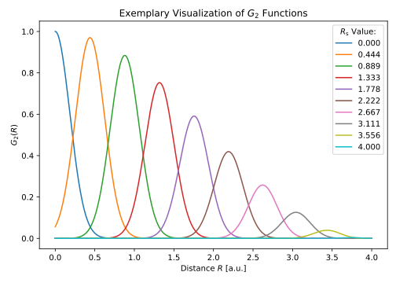

.. _sec-acsf:
.. highlight:: none

################################
Atom-Centered Symmetry Functions
################################

A fundamental problem with the use of neural networks for the construction of
high-dimensional potential-energy hypersurfaces is the generation of suitable
input features with which the networks can be fed. The raw coordinates are
unsuitable for several reasons, as pointed out by J. Behler :cite:`acsf`:
Translations or rotations of a system are energy-conserving operations,
regardless of the change in the absolute coordinates. However, this condition
wouldn't be strictly fulfilled for networks that are trained on the absolute
atomic coordinates. Otherwise the network would be fitted to potentially
contradicting data, since two different inputs would have to lead to exactly the
same output (i.e. total energy). The same reasoning applies to the exchange of
two atoms of the same type as well as the requirement for a constant number of
input features, regardless of possibly changing coordination numbers
(i.e. during MD simulations).

Therefore Fortnet implements the so-called Atom-centered Symmetry Functions
(ACSF) :cite:`acsf`, proposed by J. Behler as a possible choice of symmetry
mappings, listed below:

.. math::

   \begin{align*}
   f_\mathrm{c}(R_{ij}) &=
   \begin{cases}
   \frac{1}{2}\left[\cos\left(\frac{\pi R_{ij}}{R_\mathrm{c}}\right)+
   1\right]&\text{ for }R_{ij}\leq R_\mathrm{c} \\ 0 &\text{ for }R_{ij}>
   R_\mathrm{c}
   \end{cases}
   \end{align*}

radial functions:

.. math::

   \begin{align*}
   G_i^{1,Z_1} &= \sum_j^{|Z_1|} f_\mathrm{c}(R_{ij}) \\
   G_i^{2,Z_1} &= \sum_j^{|Z_1|} e^{-\eta (R_{ij} - R_\mathrm{s})^2}
   \cdot f_\mathrm{c}(R_{ij})
   \\
   G_i^{3,Z_1} &= \sum_j^{|Z_1|} \cos(\kappa R_{ij})\cdot f_\mathrm{c}(R_{ij})
   \end{align*}

.. math::

   \Theta_{ijk} =
   \arccos\left(\frac{\boldsymbol{R}_{ij}\cdot
   \boldsymbol{R}_{ik}}{R_{ij}\cdot R_{ik}}\right)

angular functions:

.. math::

   \begin{align*}
   G_i^{4,Z_1,Z_2} &= 2^{1-\xi} \sum_{j\neq i}^{|Z_1|}\sum_{k\neq i}^{|Z_2|}
   (1+\lambda\cos\Theta_{ijk})^\xi \cdot e^{-\eta (R_{ij}^2
   + R_{ik}^2 + R_{jk}^2)}\cdot f_\mathrm{c}(R_{ij})f_\mathrm{c}(R_{ik})
   f_\mathrm{c}(R_{jk}) \\
   G_i^{5,Z_1,Z_2} &= 2^{1-\xi} \sum_{j\neq i}^{|Z_1|}\sum_{k\neq i}^{|Z_2|}
   (1 + \lambda\cos\Theta_{ijk})^\xi \cdot e^{-\eta (R_{ij}^2 + R_{ik}^2)}\cdot
   f_\mathrm{c}(R_{ij})f_\mathrm{c}(R_{ik})
   \end{align*}

Apart from the manual specification of each G-function, including suitable
parameters, an automatic generation scheme is available via the HSD input. More
detailed information are provided by the subsequent sections.

=========================
Cross-Functional Settings
=========================

Cross-functional settings of the ACSF ``Mapping`` block may be specified
according to the subsequent sections:

Element-Resolved and -Unresolved Scheme
---------------------------------------

In general the neighbor list to calculate the G-function of atom :math:`i` is
element-resolved, resulting in a huge number of input nodes depending on the
number of parametrizations per function and the number of different elements in
the dataset:

.. math::

   N_\mathrm{in} = N_\mathrm{elements}\cdot \sum_{i=1}^{5}N_{G^i} +
   \frac{N_\mathrm{elements}!}{2!\,(N_\mathrm{elements}-2)!}\cdot
   \sum_{i=4}^{5}N_{G^i}

Fortnet further provides the ``Reduce`` entry (default: No) in the ACSF mapping
block to facilitate the neighbor list calculations to an element-unresolved
scheme, thus significantly reducing the number of generated input features per
atom::

  Features {
    Mapping = ACSF {
           .
	   .
      Reduce = Yes
    }
  }

The obvious weakness of this approach is that contradictory data may arise,
since the features of an atom surrounded by neighbors of the same element, for
example, would not differ from those of an atom surrounded by atoms of deviating
elements.

This might be remedied by :ref:`Atom-Specific Scaling Factors <sec-acsf_atomid>`
as optional setting of each ACSF function, including those generated by the
automatic scheme.

Standardization
---------------

Due to the nature of the ACSF it is likely to get input values of very different
orders of magnitude. To compensate for this and achieve an improvement in
convergency and overall stability, it is possible to apply a simple z-score
standardization in the background, before feeding the network. This behavior is
controlled via the ``Standardization`` option (default: No) of the ACSF mapping
block::

  Features {
    Mapping = ACSF {
           .
	   .
      Standardization = Yes
    }
  }

===============================
Manual G-Function Specification
===============================

In some situations it is desired to define the G-functions to be calculated
manually, in order to have full control over the selected parameters. The
individual HSD ``Function`` blocks of the mapping sections read as::

  Features {
    Mapping = ACSF {
      Reduce = No
      Standardization = Yes
      Function = G1 {
	AtomID = 0
	RCut = 4.0
      }
      Function = G2 {
	AtomID = 0
	RCut = 4.0
	Eta = 1.0
	Rs = 2.0
      }
      Function = G3 {
	AtomID = 0
	RCut = 4.0
	Kappa = 1.0
      }
      Function = G4 {
	AtomID = 0
	RCut = 4.0
	Xi = 1.5
	Eta = 1.4
	Lambda = 1.0
      }
      Function = G5 {
	AtomID = 0
	RCut = 4.0
	Xi = 1.5
	Eta = 1.3
	Lambda = -1.0
      }
    }
  }

The ``AtomID`` entry is always optional (c.f.
:ref:`Atom-Specific Scaling Factors <sec-acsf_atomid>`).

==============================
Automatic Parameter Generation
==============================

The automatic ACSF parameter generation scheme aims to cover the cutoff sphere
as evenly as possible, with the number of symmetry functions available
:cite:`prophet`. The user HSD input is already known from the introductory
sections and looks similar to this::

  Features {
    Mapping = ACSF {
      Reduce = No
      Standardization = Yes
      Function = Auto {
	RCut = 4.0
	NRadial = 10
	NAngular = 8
      }
    }
  }

The corresponding parameters are then generated based on the number ``NRadial``
of :math:`G^2` and the number ``NAngular`` of :math:`G^5` functions specified,
as well as the cutoff radius ``RCut`` in Angstrom.

It is also possible to specify multiple ``Function = Auto {}`` blocks or
manually add more functions as a supplement.

.. warning::

   Maintaining a certain order of HSD blocks, specifying ACSF mappings, is
   important in case that results are to be reproduced.

Radial Parameters
-----------------

The :math:`G^2` function is used as radial mapping, therefore sensible values
for the peak position :math:`R_\mathrm{s}` and width :math:`\eta` of the
Gaussians are to be determined. :math:`R_\mathrm{s}` is chosen to go from 0 to
:math:`R_\mathrm{c}` in equidistant steps. The width evaluates to the following
more or less arbitrary equation:

.. math::

   \eta = \frac{5\cdot \ln(10)}{4a^2}\quad\text{where}\quad
   a = \frac{R_\mathrm{c}}{N_\mathrm{rad}-1}

The figure below shows the :math:`G^2` functions resulting for the HSD input
example above:

Angular Parameters
------------------

The :math:`G^5` function is used as angular mapping, therefore sensible values
for the pre-factor exponent :math:`\xi`, :math:`\lambda`-parameter and width
:math:`\eta` of the Gaussians are to be determined. :math:`\xi` is chosen to go
from 1 to 16 in equidistant steps, in order to obtain functions that are
strictly separated from one another. The width, again, evaluates to the
following more or less arbitrary equation:

.. math::

   \eta = \frac{2\cdot \ln(10)}{R_\mathrm{c}^2}

Last but not least, the parameter :math:`\lambda` alternately takes the values
-1 and 1, as suggested by the original ACSF paper :cite:`acsf`:

.. math::

   \lambda = \{-1,1\}

.. _sec-acsf_atomid:

=============================
Atom-Specific Scaling Factors
=============================

One possible extension of the ACSF mappings is the incorporation of external
atomic scaling factors :math:`q_{ij} = q_i \cdot q_j`, hereinafter referred to
as atom identifiers, in the cutoff function :math:`f_\mathrm{c}`:

.. math::

   \begin{align*}
   f_\mathrm{c}(R_{ij}) &=
   \begin{cases}
   \frac{\color{red}{q_{ij}}}{2}\left[\cos\left(\frac{\pi R_{ij}}{R_\mathrm{c}}
   \right)+1\right]&\text{ for }R_{ij}\leq R_\mathrm{c} \\ 0 &\text{ for }R_{ij}
   >R_\mathrm{c}
   \end{cases}
   \end{align*}

In addition to the structural information, atom-specific
features can thus be taken into account. A reasonable choice for the atom
identifiers would be, for example, the Mulliken populations from a quantum
mechanical simulation of the system.

The atom identifiers are extracted from the external atomic features provided by
the dataset. To do so, the dataset must provide at least one external feature
per atom to choose and an appropriate entry in the ``Function`` HSD-block of the
user input that specifies the index of the external feature set::

  Function = Auto {
    AtomID = 1
    RCut = 4.0
    NRadial = 10
    NAngular = 8
  }

The integer index corresponds to the atomic feature of the dataset to extract
and must take a value between one and the number of features per atom provided.
By default this index is chosen to be 0, which corresponds to neutral atomic
prefactors of 1.0.
