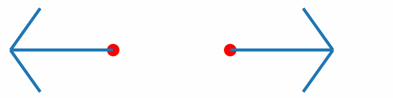

.. _sec-derivatives:
.. highlight:: none

*****************************
Calculating First Derivatives
*****************************

[Input: `recipes/analysis/derivatives/`]

The ability to calculate the first (negative) derivatives
:math:`-\frac{\partial E_i}{\partial \vec{R}_j}` of system wide network
predictions :math:`E_i` w.r.t. the atom coordinates :math:`\vec{R}_j` is of
central importance in terms of inferring properties like atomic forces
:math:`\vec{F}\,^i_{\!j}`.

For networks trained on purely ACSF based features, generated by Fortnet, the
calculation of such derivatives can be conveniently enabled in the ``Analysis``
block of the HSD input. The analysis is based on the central finite difference
(please mind the sign flip that was carried out in order to address the minus
sign in front of the gradients):

.. math::

   \begin{align*}
   \vec{F}\,^i_{\!j} = -\frac{\partial E_i}{\partial \vec{R}_j} \approx
   \frac{E_i(\vec{R}_j - \Delta \vec{R}_j) - E_i(\vec{R}_j + \Delta \vec{R}_j)}
   {2\Delta\vec{R}_j}
   \end{align*}

Internally, Fortnet uses atomic units which is also valid for the
:math:`\Delta`-parameter with the dimension being length (unit: Bohr).

This chapter should serve as a tutorial guiding you through your first force
calculations using Fortnet. As an exemplary dataset, the energy-distance scan of
an :math:`\mathrm{H}_2` molecule is used. The procedure is split into two
major steps:

* providing an appropriate input to Fortnet
* extracting and analysing the results

Accordingly, you will have learned all the tools to perform, for example,
geometry optimizations or molecular dynamics based on Fortnet's predictions.

Providing the Input
===================

The specification takes place in the ``Analysis`` block of the HSD input::

  Data {
    Dataset = 'fnetdata.hdf5'
    NetstatFile = 'fortnet.hdf5'
  }

  Options {
    ReadNetStats = Yes
    Mode = 'validate'
  }

  Analysis {
    Forces = FiniteDifferences {
      Delta = 1e-02
    }
  }

The absolute displacement :math:`\Delta \vec{R}_j` of the atomic coordinates is
determined by the ``Delta`` parameter, which defaults to
:math:`10^{-2}\,\mathrm{a_0}` and may be omitted if this value seems acceptable
to you, i.e.::

  Analysis {
    Forces = FiniteDifferences {}
  }

Examining the Output
====================
As usual in validation or prediction mode the relevant output ``fnetout.hdf5``
is written to disk and contains the additional results of the force analysis.

By using the ``Fnetout`` class within the ``Fortformat`` Python framework,
the atomic forces may be extracted by accessing the corresponding property:

.. code-block:: python

  #!/usr/bin/env python3

  '''
  Application example of the Fortformat package, based on an output
  file that contains atomic forces, resulting from finite differences.
  '''

  import numpy as np
  from fortformat import Fnetout

  def main():
      '''Main driver routine.'''

      fnetout = Fnetout('fnetout.hdf5')
      forces = fnetout.forces

      # print forces of each datapoint, network
      # output and atom to illustrate the indexing:
      for idata in range(len(forces)):
	  for iout in range(len(forces[idata])):
	      for iatom in range(np.shape(forces[idata][iout])[0]):
		  print(forces[idata][iout][iatom])

  if __name__ == '__main__':
      main()

Please note that this is definitely not the most elegant way to extract the data
but rather an illustration of the underlying indexing.

If the force vectors of the two hydrogen atoms are plotted together with the
corresponding geometries, you should obtain something similar to the following
animation:

Inline with our expectations, repulsive forces are present for interatomic
distances smaller than the equilibrium distance, and attractive forces for
distances beyond.
