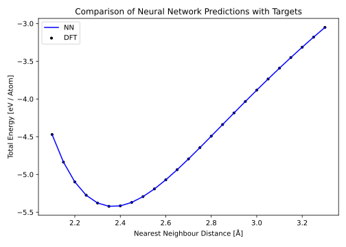

.. _sec-firstpredict:
.. highlight:: none

******************************
First Predictions with Fortnet
******************************

[Input: `recipes/basics/firstpredict/`]

This chapter should serve as a tutorial guiding you through your first
predictions using Fortnet. The network from the
:ref:`previous section <sec-firsttrain>`, trained on the :math:`E`-:math:`V`
scan of a primitive silicon unitcell in the diamond phase, is used as a starting
point. The procedure is split into three major steps we are already familiar
with:

* telling Fortnet what to do,
* running Fortnet,
* analysing the results.

Providing the Input
===================

[Input: `recipes/basics/firstpredict/validate/`]

Fortnet accepts the input in the Human-readable Structured Data (HSD) format.
The input file must be called `fortnet_in.hsd`.  The input file used in this
example looks as follows::

  Data {
    Dataset = 'training_data'
    Standardization = No
    NetstatFiles = Type2FileNames {
      Prefix = "./"
      Suffix = ".net"
      LowerCaseTypeName = No
    }
  }

  Options {
    ReadNetStats = Yes
    Mode = 'validate'
  }

The order of the specified blocks in the HSD input is arbitrary. You are free to
capitalise the keywords and any physical units as you like, since they are
case-insensitive. This is not valid however for string values, especially if
they are specifying file names.

So let's have a look at the two necessary input blocks, ``Data`` and
``Options``.

Data
----
::

  Data {
    Dataset = 'training_data'
    Standardization = No
    NetstatFiles = Type2FileNames {
      Prefix = "./"
      Suffix = ".net"
      LowerCaseTypeName = No
    }
  }

The ``Data`` block looks exactly the same as for the training process, because
we first want to check that the network has actually learned something and is
able to reproduce the training dataset with sufficient accuracy. With other
words, we are validating the resulting network potential, which leads us to the
running mode specified in the next HSD block below.

Options
-------
::

  Options {
    ReadNetStats = Yes
    Mode = 'validate'
  }

The basic program behavior gets defined in the ``Option`` block of the input,
starting with the running mode of Fortnet. Since we want to predict structures
based on an existing network potential, we have to set the ``ReadNetStats``
entry to `Yes` in order to read in the netstat files as well as the `acsf.out`
file, which contains the parameters of the ACSF used during the training
process. Subsequently the ``Mode`` is set to `validate`, so Fortnet will do a
prediction run and additionally list the corresponding target values in the
``fnetout.xml`` output file for later comparison.

.. note::

   When ``ReadNetStats`` is set to `No` in validation or prediction mode,
   Fortnet will issue a warning that tells the user that this isn't a valid
   combination and overwrites the input to `Yes`.

Running Fortnet
===============
At this point you are ready to execute Fortnet. To do so, invoke the ``fnet``
binary without any arguments in the directory containing the ``fortnet_in.hsd``
file. As mentioned above, Fortnet writes some information to the standard
output. Therefore it is recommended to tee this output for later investigation::

  fnet | tee output

In most cases Fornet will be compiled with MPI parallelism enabled. To make use
of the associated speedup, issue::

  mpirun -np 4 fnet | tee output

or something equivalent. Note: It may be necessary to provide the absolute path
to the ``fnet`` binary in this case.

Examining the Output
====================
Fortnet uses two output channels: 1) the standard output (which you should
redirect into a file to keep for later evaluation) and 2) various output files.
Below, these two channels are routhly explained for the prediction scenario.

Standard Output
---------------
Most of the standard output is identical to what was described in the previous
section. In the ``Initialisation`` section, however, the entry
`read initial netstats` will be set to `True` or `T` respectively.
::

  Initialisation

  running in validation mode
  random seed: 571070859
  read initial netstats: T

  reading ACSF from file...done

Also, instead of the output of the training process, you will now see the simple
message `Start feeding...` that indicates the start of the feeding process.
::

  Start feeding...done

When finished, a `done` will be appended and the predictions written to disk
(c.f. next section).

Fnetout
-------
The ``fnetout.xml`` file is the most important output of Fortnet as it contains
all the predictions made. In validation mode this file will also contain the
target values provided by the dataset, whereas in prediction mode thoose exact
values are generally unknown and therefore not contained in the output. For the
current example of silicon unitcells the output will look similar to this::

  <?xml version="1.0" ?>
  <fnetout>
   <mode> "validate"
   </mode>
   <output>
    <ndatapoints>25
    </ndatapoints>
    <atomic>No
    </atomic>
    <ntargets>1
    </ntargets>
    <datapoint1> 67.889390359708301 67.890976152089621
    </datapoint1>
    <datapoint2> 66.892775628163193 66.891929951387567
    </datapoint2>
          .
	  .
	  .
    <datapoint25> 61.033038205156245 61.032172773337422
    </datapoint25>
   </output>
  </fnetout>

The structure and essential entries are pretty self-explanatory. The important
clarification here is, that the datapoint entries are in the following order:
`predictions`, `targets`. In relation to the current example, it is therefore
(viewed from the left) always the predicted total energy and the target value
next to it on the right hand side. If the predictions and targets are being
plotted, an excellent agreement will be observed:

As a further analysis, the energies of next neighbor distances beyond the
training interval can be predicted. To do so, we finally got to use the pure
prediction mode by setting ``Mode`` of the ``Option`` block to `predict`. The
corresponding figure below impressively shows a major weakness of neural
networks, their poor extrapolation capabilities:

[Input: `recipes/basics/firstpredict/predict/`]

Outside the next neighbor distances for which there was available data in the
training process (visualized by the vertical, dashed lines), there is a
significant deviation between the predictions and reference values. This is
something that must always be considered when dealing with neural networks.
