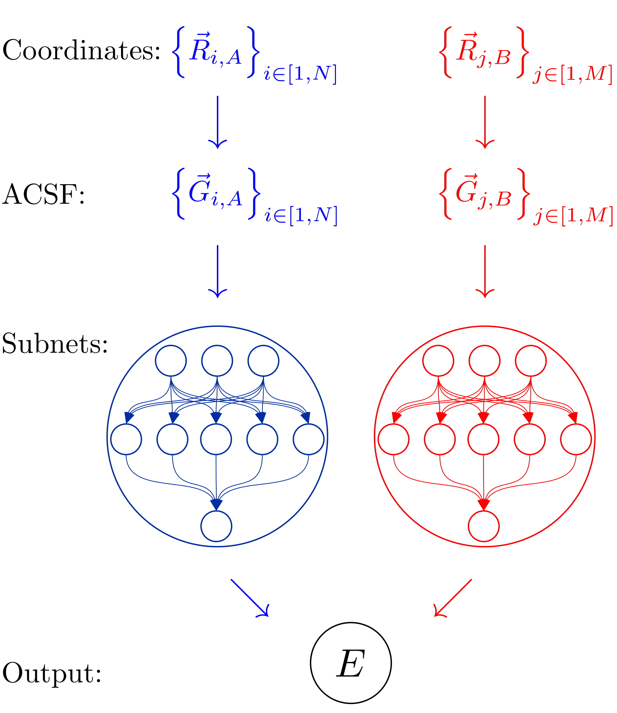

.. _sec-bpnn:
.. highlight:: none

################################
Behler-Parrinello-Neural-Network
################################

The neural network topology implemented by Fortnet was proposed by J. Behler and
M. Parrinello in 2007 and has worked its way into computational materials
science as one of the most famous neural network architectures to represent
potential-energy surfaces :cite:`bpnn`.

By representing the systems total energy (or targets in general) as a sum of
atomic contributions, in combinations with suitable symmetry mappings (c.f.
:ref:`ACSF <sec-acsf>`), it overcomes the limitations of conventional fixed
structure topologies. The BPNN super-nn contains several sub-nn's, each of which
is assigned to a certain type of atom (i.e. element or species). Accordingly,
the subnets are fed (forward) with the features of the atoms of their specific
type and added up in the case of global targets (i.e. system properties like the
total energy).

To clarify this admittedly abstract explanation of the
Behler-Parrinello-Neural-Network architecture, the figure below shows the
topology described for the special case of two atom species :math:`A` and
:math:`B` with a single output node:

In general, the activation status :math:`a_i^l` of a single neuron :math:`i` in
layer :math:`l` can be calculated as follows:

.. math::

   a_i^l = f_l\left(\sum_{k=1}^{N_{l-1}}w_k^{l-1}a_k^{l-1} + b_k^l\right)

There the index :math:`k` runs over all neurons of the adjacent layer
:math:`l-1`. Once this fundamental equation is known, the input :math:`a_i^1`
(i.e. :ref:`ACSF <sec-acsf>`) can be propagated through the entire subnet, with
the arguments of the activation functions being logged for later
backpropagation. For global system properties the quantity of interest finally
follows as a summation of atomic contributions of the species:

.. math::

   E = \sum_{i=1}^{N_\mathrm{type}}\sum_{j=1}^{N^\mathrm{at}_i} E_j^i

In the case of atomic properties (i.e. forces) the atomic contributions can
obviously be used directly, since a summation would be superfluous.
