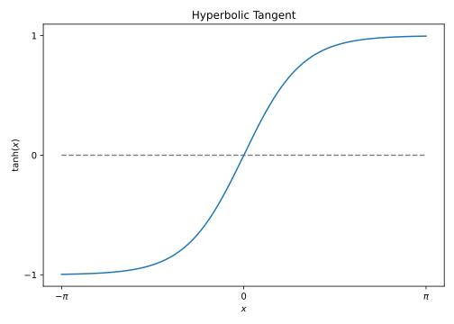
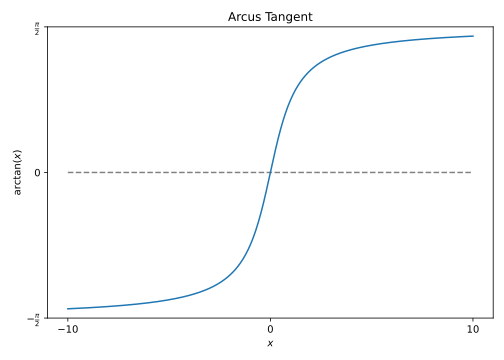
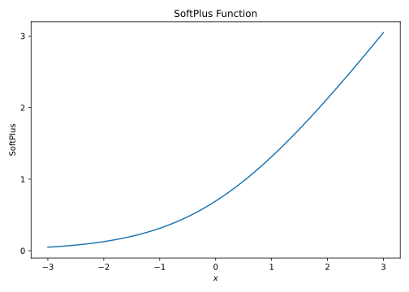
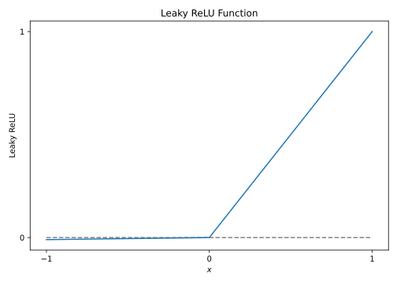
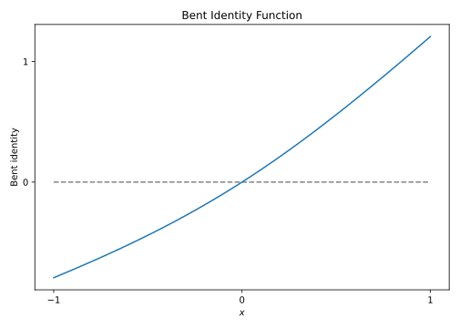
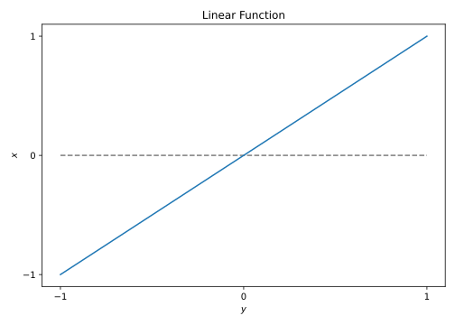

.. _sec-transfer:
.. highlight:: none

####################
Activation Functions
####################

Choosing a suitable activation function for the task at hand can make a
significant difference, depending on the situation or dataset. In order to give
you a certain freedom in this sense, Fortnet implements the following functions:

  - hyperbolic tangent
  - arcus tangent
  - sigmoid function
  - softplus function
  - gaussian function
  - (leaky) ReLU function
  - Bent identity function
  - heaviside function
  - linear function

The activation function is selected in the ``Network`` block of the HSD input.
The functions and an associated, exemplary network block, are listed below.

.. note::
   A linear function is always used as the activation function of the output
   layer, in order to be able to represent all real-valued results.

Hyperbolic Tangent
==================
::

  Network = BPNN {
    Hidden = 2 2
    Activation = tanh
  }

Arcus Tangent
==================
::

  Network = BPNN {
    Hidden = 2 2
    Activation = atan
  }

Sigmoid
=======
::

  Network = BPNN {
    Hidden = 2 2
    Activation = sigmoid
  }

SoftPlus
========
::

  Network = BPNN {
    Hidden = 2 2
    Activation = softplus
  }

Gaussian
========
::

  Network = BPNN {
    Hidden = 2 2
    Activation = gaussian
  }

ReLU
====
::

  Network = BPNN {
    Hidden = 2 2
    Activation = relu
  }

Leaky ReLU
==========
::

  Network = BPNN {
    Hidden = 2 2
    Activation = lrelu
  }

Bent Identity
=============
::

  Network = BPNN {
    Hidden = 2 2
    Activation = bent
  }

Heaviside
=========
::

  Network = BPNN {
    Hidden = 2 2
    Activation = heaviside
  }

Linear
======
::

  Network = BPNN {
    Hidden = 2 2
    Activation = linear
  }

